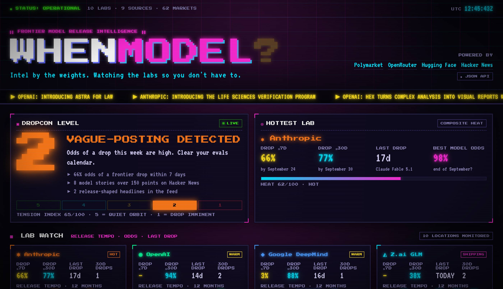

# whenmodel.com

**Frontier AI model release intelligence.** One page, one number: **DROPCON**, from 5 (quiet orbit) to 1 (release surge), read off prediction-market release odds. Beside it, the lead signals that have run ahead of past launches (stealth slots, leaks, scheduled streams, pending architectures), each with its track record, and the launches that already landed. Built in the spirit of [pizzint.watch](https://www.pizzint.watch), with an 80s CRT skin.

Live at **https://whenmodel.com** · JSON at `/api/dashboard.json`



## What it watches

| Source                                                                    | Feeds                                                                        | Edge cache |
| ------------------------------------------------------------------------- | ---------------------------------------------------------------------------- | ---------- |
| [Polymarket](https://polymarket.com) gamma API (`ai-releases`, `ai` tags) | per-lab "released by" curves (the only scored input), best-model race        | 5 min      |
| [OpenRouter](https://openrouter.ai) models API                            | newest listings, release events, stealth slots, the launched-family filter   | 10 min     |
| [Hugging Face](https://huggingface.co)                                    | trending text-generation repos, daily papers                                 | 15–30 min  |
| Hacker News via Algolia                                                   | model stories over 60 points in the last 48 h; launch stories (150+ points)  | 5 min      |
| Hacker News leak search via Algolia                                       | leak-shaped titles from the last 14 days, any points                         | 30 min     |
| [TestingCatalog](https://www.testingcatalog.com) RSS                      | pre-release sightings from app builds                                        | 30 min     |
| YouTube feeds: OpenAI, Anthropic, Google DeepMind, Google for Developers  | scheduled streams (`views=0`), with the watch page's start time when present | 30 min     |
| `transformers` model registry (`models/__init__.py`, jsdelivr fallback)   | architectures merged before any public listing                               | 30 min     |
| OpenAI RSS, DeepMind RSS, Anthropic newsroom, xAI developer release notes | lab announcements                                                            | 15 min     |
| GitHub releases for the Anthropic, OpenAI, Google and xAI SDKs            | changelog mentions of new model ids                                          | 30 min     |
| D1 first-seen ledger (`HISTORY_DB`)                                       | when whenmodel first saw each stealth slot, stream, module and dated post    | read live  |

The lead adapters cache for 30 minutes: their signals run days ahead, and every cold fetch competes for the Worker's six simultaneous connections. Each source is named once, in `src/domain/sources.ts`, and shows up in the **Source health** list.

X/Twitter has no free read API and the mirrors are gone, so the page links a watchlist of accounts instead of ingesting posts.

### DROPCON (v3)

Scored 0–100 in `src/domain/dropcon.ts` from Polymarket release odds alone (`DROPCON_ALGORITHM_VERSION = 3`):

| Term                                                              | Points                       |
| ----------------------------------------------------------------- | ---------------------------- |
| P7: best trusted frontier-family P(release within 7 days)         | 80 × P7                      |
| P30 beyond P7                                                     | 10 × max(0, P30 − P7)        |
| repricing: rise in P7 over the last 24 hours (from the D1 series) | 10 × clamp(ΔP7 / 0.30, 0, 1) |

Levels: 1 at 75 and above, 2 at 55, 3 at 35, 4 at 15, 5 below (`LEVEL_BANDS`, which `src/domain/history.ts` imports). Each row is rounded on its own and the score is their sum, so the provenance list on the page adds up; when the best 30-day read is a different family from P7's, its row names both. The headline names the row that scored most and quotes the heaviest market's own mid at that rung, not the pooled fit. When the scored read differs from the quote it says so: "Polymarket prices 83% that the next Claude Sonnet ships by Sep 30 (84% within 7 days on its curve)". Each market row links to the market it quotes (the repricing row links to `/api/history.json`). The level blurb describes P7 itself and names what lifted the level above P7's own band (the 30-day odds, a 24-hour rise).

What goes into P7 and P30, per frontier lab:

- **Frontier text families only.** Image, video, audio and voice markets (GPT Image, Sora, Veo, Imagen, Nano Banana …) are left out by `isTextReleaseFamily`.
- **Not a model that just launched.** A launched model's market keeps trading near 1 until its first YES rung closes: a median 2.6 hours and up to 63.3 hours after the announcement, across 39 markets covering 21 launches in the replay. A family whose model listed on OpenRouter in the last 4 days is dropped and named on the lab card.
- **Trusted reads only.** Each family's cumulative rungs become a monotone curve (`familyCurves`, `readCurve`). A read at a rung, between rungs, past the last rung (a floor) or on day-bucket bids is trusted. When the next rung lies more than 14 days past the horizon, the read holds the earlier rung as a floor instead of interpolating across the gap. When the family's day buckets ("released on…?") cover the horizon with an ask on every bucket, the sum of those asks caps the read (a no-arbitrage ceiling, shown as "at most"). A constant-hazard stretch from now to a first rung more than 14 days past the horizon is shown as "extrapolated" (a `~` on the card) and never scored or used in the forecast.
- **Thin books are ranges, not odds.** An outcome with a spread over 10¢ or a one-sided book is left out of the curve and shown in the markets panel as a muted bid–ask range.

**States.** `ok`; `floor` when Polymarket is down (every term reads 0; the page shows a muted 5 named **FLOOR (ODDS OFFLINE)** with its scale segments dimmed); `no-signal` when Polymarket and OpenRouter are both down (a muted `?`, every segment dimmed, and the tab title `DROPCON — NO SIGNAL`). A degraded reading holds the previous level in `/api/history.json`.

**Why a lead score and not a probability.** `pnpm backtest:replay` replayed hourly as-of market reads from 1 April to 26 September 2026 through the Worker's own curve code and scored candidate formulas for "a frontier lab lists a text model within 72 hours". Fitted on 1 April to 16 July (20 release events) and tested on 16 July to 26 September (25 events), the best formula (noisy-OR of per-lab reads plus a 23.4% unpriced rate) scored an out-of-sample Brier skill of **−0.002** (95% block-bootstrap interval −0.566 to +0.344) against the 39.0% train base rate. The pre-registered bar was +0.02 with sane reliability, and reliability failed too (worst bin off by 0.47), so the level stays a hand-weighted lead score. Only 9 of the 25 test events had a priced market at all. The page no longer shows that probability. Under the provenance it answers "Is this a forecast? No", links `/backtest`, and states the base rate plainly from `d.forecast`: the train window's (39% of 72-hour windows) and the held-out window's (63%), since the train rate alone made a typical recent reading look like unusual activity. The skill figure sits in a collapsed "why it's not a probability" note.

**The level itself is untested.** Its weights are hand-set, not fitted, and neither its bands nor how well it separates launch weeks from quiet ones has been evaluated. The one form of its main input the replay did score is not reassuring: P7's shape, the maximum over labs of each lab's best read (formula (b)), scored a Brier skill of **−1.48** (95% interval −3.36 to −0.28) against the base rate at 7 days. It underpredicted a 94% release rate with a mean forecast of 71%, and every sensitivity variant's interval sat below zero as well. `LEAD_INPUT_SKILL_7D` in `src/domain/forecast.ts` carries the figure to `/backtest`, the FAQ and `dropcon.notes`, and `test/scripts/replay.test.ts` pins it to the replay.

Each lab card shows its family's 72-hour, 7-day and 30-day reads, each labelled **trusted** or **extrap.** with its bracket (the rungs it sits between, a held floor, an "at most" cap), the lead flags pointing at that lab (leaks, streams, pending architectures, keynotes; linked to the early-warning rows, never scored; stealth slots are anonymous and stay unattributed), and a **heat** score used to rank the cards: 20 × P72 + 40 × P7 + 15 × P30 from trusted reads, plus up to 25 for recency (days since the last listing and launches in the last 30 days). Recency is labelled a burstiness prior: labs that shipped recently shipped again more often than "overdue" ones in the cadence backtest. The hottest card is summarised in one linked line under the level. Cards run five across at 1360 px and wider; at 480 px and narrower they drop the tempo histogram, X handles and market link.

**History strip.** Beside the level, `HistoryStrip.astro` draws the last 30 days of the D1 score series, one bar per hour, height the score and colour the level after hysteresis (`historyStrip` in `src/domain/history.ts`). Readings from an earlier `algorithmVersion` are grey and labelled with their version at a break line, because their scores are not comparable; before the first v3 reading the strip says when v3 history starts. It reads the same edge memo as `/api/history.json` (`history@v4@30d`, 15 minutes) through `loadHistoryForPage` in `src/app/load-dashboard.ts`, so it costs no upstream call. A read that fails or takes over 2 s renders the strip as offline, and the page then skips D1 for 60 seconds in that colo; the level itself is unaffected.

### Early warnings and landed

Neither moves the level; each is shown with the record behind it (`src/domain/early-warnings.ts`, `src/domain/landed.ts`):

| Early warning                                                         | Track record                                                                                                                  |
| --------------------------------------------------------------------- | ----------------------------------------------------------------------------------------------------------------------------- |
| OpenRouter stealth slots                                              | 11 revealed slots listed officially a median 7 days later; 5 were frontier labs (median 7.8 days)                             |
| Unlisted leaks (HN leak search, TestingCatalog), attributed by source | 10 of 13 resolved leak stories listed within 14 days (77%), median 1.6 days later; in-sample                                  |
| Scheduled streams on lab YouTube channels                             | 5 OpenAI launch streams were scheduled 2.2–44.2 h ahead (median 4.9 h); GPT-5.4, GPT-5.5 and both GPT-6 had none              |
| Pending `transformers` architectures (language models only)           | merged ahead of the first HN story for 7 of 16 dated releases (median 6.9 days, Qwen and Z.ai only); 5 coincided and 4 lagged |
| Keynote windows (72 h before to 24 h after, e.g. DevDay)              | 2 of 5 past keynotes debuted a frontier model (1 weak); markets already price known keynotes                                  |

A leak leaves the board once any model it names lists, which is how its track record counts it; an HN repost of a TestingCatalog story is one story. A stream counts as confirmed once the ledger saw it on an earlier poll at least 15 minutes before. **Landed** lists frontier launches listed on OpenRouter in the last 7 days, Hacker News launch stories (150+ points, release-shaped, one per URL and model) and first-party announcements (one per post; xAI's release notes are anchors on one page and count one per note), and raises **MODELS JUST LANDED** beside the level while a launch is under 48 hours old.

### /backtest

`/backtest` is the evidence page. It opens on the question, the method and the headline results, then draws the v3 replay above from `data/backtest/v3-replay.json`: a server-rendered SVG of the 72-hour forecast (d) and the best 7-day lab read, launch markers (filled when the launching lab's market was priced first), the fit/held-out split and both base rates, with a weekly table as its text twin. The results block gives every formula's held-out skill, 95% interval and sanity at each horizon, the pre-registered rule, rolling-origin folds, sensitivity variants, reliability with bin counts, per-lab skill and the replay's limits. Every number on it is read from the JSON or a constant. Wave 1's hand-timed sections follow, labelled as such: lead times, pre-announced versus surprise launches, false alarms, Polymarket's calibration on its own rungs, stealth reveals (from `REVEAL_STATS`, never scored), scheduled broadcasts, architecture merges and the signals that tested and didn't lead. Wave 1's in-sample "market max" Brier table is gone because the v3 held-out scores contradict it. The page scores market reads, not the level, and its limits block says so. `pnpm backtest` regenerates `data/backtest/*.json` from the committed raw pulls (`--refresh` re-pulls them, about 750 requests); `pnpm backtest:replay` reruns the DROPCON v3 calibration study into `data/backtest/v3-replay.json`. Both are deterministic for a given raw set.

### Point-in-time review

The JSON response includes `measurement.schema` (4), `measurement.algorithmVersion` (3), and the exact score inputs, including the market read behind each term. [The September 2026 review](docs/algorithm-review-2026-09-23.md) records the discovered odds bug, recent release coverage and historical-evidence limits.

Capture a manual immutable observation and evaluate an exported archive:

```sh
node scripts/capture-dashboard.mjs --dir /tmp/whenmodel-archive
node scripts/evaluate-dashboard.mjs --archive /tmp/whenmodel-archive --releases /tmp/releases.json
```

Release events are a JSON array of `{ "labId": "xai", "model": "grok-4.7", "releasedAt": "<verified UTC launch timestamp>", "sourceUrl": "<official announcement URL>" }`. Use a precise sourced time; a date-only announcement cannot establish an exact lead time. `model` exactly matches the listing ID, ID suffix, name or URL within that lab; variants are separate events.

The report selects the latest observation collected strictly before release within each 24-hour, 72-hour and seven-day lead-up window. It reports collection time and actual lead time, and labels absent history `unobserved`. First post-release listing detection is separate from the listing's own timestamp. The collector revision identifies the collector checkout, not the deployed Worker revision. These commands do not schedule collection. The Worker cron records observations independently of visitors using `HISTORY_DB`. History retains up to 90 days, 8,640 records and 128 MiB of JSON payload. Each payload is capped at 32 KiB. Database overhead is additional. Expiration deletes at most 96 old records per run; capacity errors stop new writes without evicting recent evidence. Retries use the scheduled quarter-hour as an immutable key.

The D1 migrations must precede deployment. Migration `0002_first_seen.sql` adds `score_series` (one narrow row per slot: score, level, `headline_p`, degraded; `/api/history.json` and the repricing term read it) and the `first_seen` ledger, and backfills `score_series` from existing snapshots. **Apply 0002 to the remote database before merging the v3 branch**: Cloudflare Builds deploys `main`, and the new Worker writes and reads both tables.

```sh
pnpm exec wrangler d1 migrations apply whenmodel-history --local
op run --env-file .env.op -- pnpm exec wrangler d1 migrations apply whenmodel-history --remote
```

0002 was edited before its first remote apply (the rollup column became `headline_p`). A database that applied the earlier draft has a `p7` column instead and wrangler will not re-run the file, so recreate that local state rather than migrating it.

The ledger records first sightings, keyed by the capture that saw them, only for sources whose fetch succeeded completely that capture: a partial list must never seed a baseline. A YouTube channel whose feed fails is read from its last good copy (at most two hours old, its candidates judged as of that copy's fetch time), and such a poll still counts as complete. Dated posts are recorded from every item fetched, not the 60-item display feed, and a day-precision post seen more than 36 hours after its printed date never reads as newly announced. The compact snapshot clips every string by its encoded size; a test builds the worst case (every list full, every string over-long and multi-byte) and holds it under the 32 KiB cap.

To export the latest 96 observations for evaluation:

```sh
op run --env-file .env.op -- pnpm exec wrangler d1 execute whenmodel-history --remote --json --command 'SELECT scheduled_slot, observed_at, payload_json FROM dashboard_snapshots ORDER BY scheduled_slot DESC LIMIT 96' > /tmp/whenmodel-history.json
node scripts/export-d1-history.mjs /tmp/whenmodel-history.json /tmp/whenmodel-archive
```

For older pages, add `WHERE scheduled_slot < '<last exported slot>'`. Export preserves the original observation time; it does not backdate a new fetch. The [review](docs/algorithm-review-2026-09-23.md) documents cost assumptions and the existing-history gap.

## How it runs

Astro 7 renders on demand on a Cloudflare Worker via `@astrojs/cloudflare`. A separate 15-minute scheduled handler records compact observations in D1; page requests do not write history:

- every upstream call goes through `cachedText` / `cachedJson` in `src/infra/edge-cache.ts`, which buffers the body and stores it in the Workers Cache API for the TTL above;
- the assembled dashboard is memoised in the same cache for 2 minutes. Concurrent requests within one Worker instance share an in-flight build; separate instances can still build independently;
- a source that fails or times out (8 s) degrades to empty data and shows up in the **Source health** list rather than taking the page down. Each panel's pill reads that panel's own sources (`sourcePill` in `src/ui/panels.ts`): LIVE, PARTIAL when some of its sources failed, DOWN when all did, and STALE once the data is 15 minutes old (`STALE_AFTER_MS`), which an open page switches to by itself. An empty panel says whether its source is down or simply had nothing. The early-warning and landed panels read the same results;
- the open page polls `/api/dashboard.json` every 5 minutes while visible, offers a reload when what it shows changed, and reloads by itself only once the visitor has been idle for a minute with nothing expanded; PAUSE AUTO-REFRESH (a 44px button on phones too) stops the automatic reload. "Changed" means the fingerprint in `src/ui/fingerprint.ts`, which hashes only what the page prints at the precision it prints it: level, score and headline, market prices as rendered ("66%", "27–84¢"), lab reads, listing ids and prices, feed, trending and early-warning ids. A rebuild that only moved the clock (`generatedAt`, a curve read sliding with its horizon, days in stealth) stays quiet;
- phones get shorter panels: at 480px and below the release and other market lists show 6 rows and Fresh Drops 8 stacked rows (with the price the table cut off), each followed by an expander; below 900px the feed shows 12 reports and an expander instead of a 640px inner scroller, which trapped the page's scroll. Measured side by side at 390px on 26 September 2026 data, the page went from 17,402px to 15,148px tall; the feed grew by 275px, the price of losing the scroll trap.

The Cache API is per Cloudflare colo, so the first visitor in a region pays one cold build. With fifteen sources a cold local build took 1.3 s, the slowest being the HN leak search (1.3 s) and Polymarket (0.9 s). That was under local `wrangler dev`, which does not enforce the Workers limit of six connections waiting for headers; a cold build fires about 22 upstream fetches, each after a cache lookup, and a queued fetch's 6.5 s abort timer is already running. Check the `[dashboard:build]` timings on a cold colo after a deploy before trusting the local number. Every build logs one `[dashboard:build]` line with per-source timings, and a `[diagnostic:unmapped-release-markets]` line when a release market maps to no lab. A KV-backed global snapshot would remove the cold build; it hasn't been needed.

### Code layout

| Directory        | Holds                                                                                                                                                               |
| ---------------- | ------------------------------------------------------------------------------------------------------------------------------------------------------------------- |
| `src/domain`     | Pure rules: labs, markets and family curves, drops, feed, DROPCON, forecast, early warnings, landed, the ledger's read side, `assembleDashboard`. No I/O, no clock. |
| `src/adapters`   | One module per upstream: a pure DTO→domain mapper plus a cached `fetch*()`.                                                                                         |
| `src/infra`      | Edge cache wrapper, `collect()` (timeout + degrade + timing), D1 snapshot store and ledger reads, the `HISTORY_DB` binding, text helpers.                           |
| `src/app`        | `loadDashboard()`: fan out, collect, assemble, memoise. `captureHistory()`: the cron's snapshot, rollup and first-seen writes.                                      |
| `src/ui`         | Presentation: formatting, what each panel selects and its source pill (`panels.ts`), the refresh fingerprint.                                                       |
| `src/components` | Astro markup; shared styling in `src/styles/global.css`.                                                                                                            |

`test/` mirrors `src/`. Domain and infra are tested directly, adapters against fixtures with the cache mocked, and components through Astro's container API. Run `pnpm test --coverage` to enforce the thresholds in `vitest.config.ts`; plain `pnpm test` omits the coverage gate.

Coverage measures TypeScript modules, not Astro markup, CSS or browser scripts. Component tests check rendered HTML. Playwright checks the built Worker in Chromium for desktop alignment, narrow-screen overflow, keyboard ticker controls, reduced motion, and the panels' phone caps, expanders, feed fill and source pills (`test/browser/panels.spec.ts`).

## Develop

```sh
pnpm install
pnpm dev                              # Astro dev server (no Cache API)
pnpm build && pnpm exec wrangler dev  # the real Worker, locally
pnpm test --coverage                  # vitest plus the configured coverage thresholds
pnpm lint                             # oxlint + oxfmt --check
pnpm check                            # astro check (TypeScript 6 is pinned; 7 lacks the API astro check needs)
pnpm validate                         # lint, types, coverage and production build
pnpm exec playwright install chromium # once, for local browser tests
pnpm build && pnpm test:e2e            # starts the real Worker and checks browser behavior
pnpm backtest                         # regenerate data/backtest/*.json from the raw pulls
pnpm backtest:replay                  # rerun the DROPCON v3 calibration replay
```

Playwright serves the Worker on port 8787, or on `E2E_PORT` when set (`E2E_PORT=8820 pnpm test:e2e`). Locally it reuses whatever already answers on that port, so give each checkout its own port. To exercise the cron locally, run `wrangler dev` and request `/cdn-cgi/local/scheduled`.

GitHub CI runs on pull requests and pushes to `main`. The `check` job runs lint, types, coverage and build; the `browser` job runs the Chromium checks against the real Worker. Both checks must pass before merging to `main`.

## Deploy

Cloudflare Builds deploys `main` to the existing `whenmodel` Worker. Preview builds are disabled. Its build command is `pnpm validate`, followed by `pnpm exec wrangler deploy`; the build environment uses `NODE_VERSION=24` and `PNPM_VERSION=11.22.0`. GitHub's required checks protect merges, and Cloudflare repeats validation before uploading the Worker.

For a manual deploy, secrets come from 1Password via [`op run`](https://developer.1password.com/docs/cli/reference/commands/run/); `.env.op` holds only `op://` references. Run `pnpm validate` first.

```sh
op run --env-file .env.op -- pnpm deploy
```

The deploy token is `whenmodel-prod-v1`, issued from the `stacks/whenmodel-token` OpenTofu stack in `jasonm4130-cf`. It grants D1 Write, Workers AI Read and Workers Editor on this Worker only, so it can deploy `whenmodel` but cannot create, read or change any other Worker.

`whenmodel.com` and `www.whenmodel.com` are attached to the Worker as account-level custom domains and are deliberately **not** declared as `routes` in `wrangler.jsonc`: the deploy token cannot read zone routes for this zone, and declaring them made every deploy fail after upload.

`workers_dev` is `false`, so the site has no public `workers.dev` copy. This also keeps `wrangler deploy` from reading the account's `workers.dev` subdomain, which the scoped token is refused (API error 10000). Version URLs stay enabled through an explicit `preview_urls: true`. `wrangler versions upload` still reads that subdomain to print the Version URL, so with this token it uploads the version and then exits with that error. The version is usable at `https://<first 8 characters of the version ID>-whenmodel.<account subdomain>.workers.dev`.

To run your own copy: change `name` in `wrangler.jsonc`, set `workers_dev` to `true` (or attach your own domain), drop or replace the Skopia analytics `<script>` in `src/layouts/Layout.astro`, and `wrangler deploy`. Nothing else is account-specific.

## Contributing

Issues and pull requests are welcome. Good first contributions: a new free signal source (add an adapter under `src/adapters/` with a pure `toX(dto)` mapper, name it in `src/domain/sources.ts` and wire it with `collect()` in `src/app/load-dashboard.ts`; the health list picks it up), a new lab in `src/domain/lab.ts`, or a better DROPCON weighting backed by `pnpm backtest:replay`. A signal earns points only with an out-of-sample result behind it; until then it belongs in early warnings with its track record. Keep sources free and unauthenticated; the point is that anyone can deploy this.

## License

[MIT](LICENSE). Not affiliated with any lab, with Polymarket, or with pizzint.watch. Odds are crowd opinion, not roadmaps.
