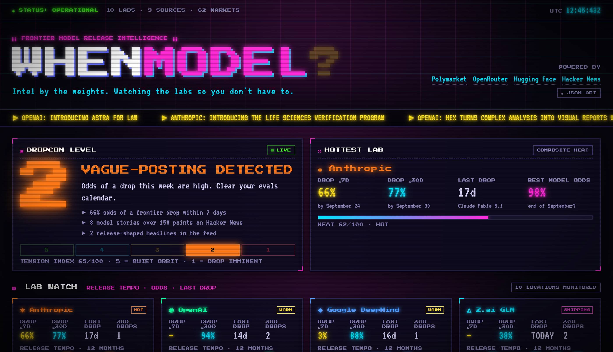

# whenmodel.com

**Frontier AI model release intelligence.** One number: **DROPCON**, from 5 (quiet orbit) to 1 (release surge), read off prediction-market release odds. Beside it, the lead signals that have run ahead of past launches (stealth slots, leaks, scheduled streams, pending architectures), each with its track record, and the launches that already landed. Built in the spirit of [pizzint.watch](https://www.pizzint.watch), signed like a transit network: each lab is a line, its next model a departure.

Live at **https://whenmodel.com** · JSON at `/api/dashboard.json`



### Pages

| Path         | What it shows                                                                                                                                                                                                                                                                                                                                                                                                                                                  |
| ------------ | -------------------------------------------------------------------------------------------------------------------------------------------------------------------------------------------------------------------------------------------------------------------------------------------------------------------------------------------------------------------------------------------------------------------------------------------------------------- |
| `/`          | The service status (the level as a station posts it), the next model departing with its 7-day odds and boarding window, the other timed lines, recent arrivals (the same list as `/radar`'s) and the newest unmarked train.                                                                                                                                                                                                                                    |
| `/labs`      | The network: every line ranked by heat, one row each with its 7-day odds or why there are none, last arrival and lead flags, linked to its page (the line page has its boarding window).                                                                                                                                                                                                                                                                       |
| `/labs/<id>` | "When will <Lab> ship?" for every lab in the registry: the next departure and how its read was taken, a strip map of the headline market's dated stops (never falling: a horizon tick read below an earlier stop gives its name to that stop), other services, service frequency (tempo), service notices and the latest station announcements (`src/ui/lab-page.ts`, `src/ui/departures.ts`). An id outside the registry is the site's 404, "Line not found". |
| `/markets`   | Markets: release timetables grouped under each line's bullet and name, one row a market, rung dates day first ("2 Oct"); then the best-model race and the benchmark and other markets, each full width.                                                                                                                                                                                                                                                        |
| `/radar`     | Service notices, headed by the count of early warnings: the warnings as one column of groups with their track records, each lab named by its line bullet and name; recent arrivals, each launch once with a tag for every source that saw it (listing, lab post, HN); fresh drops, then the feed, each full width; open weights, papers and the X watchlist folded under Elsewhere on the network.                                                             |
| `/about`     | How the service works: how the score adds up, the level bands, a one-line answer to whether it is a forecast, "Service history · last 7 days" when the week has a reading (one quiet line otherwise), the FAQ, the history of vague-posting, source health and the disclaimer.                                                                                                                                                                                 |
| `/backtest`  | The evidence page: a static report (the header says when its data was pulled), the launches priced first as the sign's one fact, the verdict in a sentence and three facts, and the replay chart; every other study is a fold under "Show the working" that opens for a link into it, and on a phone its tables stack into rows.                                                                                                                               |

Every page reads the same memoised dashboard (no page adds an upstream call; `test/app/load-dashboard.test.ts` renders each and counts), and only `/` reads the history. Old single-page anchors (`/#lab-anthropic`, `/#markets`, `/#faq`) are moved on by a small script on `/` from the table in `src/ui/site.ts`.

### Design

The site is signed like a transit network (after Vignelli's New York subway signage): paper and ink, black station signs, one bold moment per page, and each fact said once per page. The tokens (paper `#f4f2ec`, ink `#111`, sign black, the notice yellow `#fccc0a`; no status colour is a line's colour) are on `:root` in `src/styles/global.css` and mirrored in `src/ui/palette.ts`, where tests check their contrast. Every lab is a line with a fixed bullet, letter and colour in `src/ui/lines.ts` (A Anthropic, G Google, O OpenAI, X xAI, Q Qwen, M Meta, Z Z.ai, D DeepSeek, W Mistral, K Moonshot), each letter at 4.5:1 or better on its fill; `Bullet.astro` draws it. Type is Inter Tight and Geist Mono, self-hosted from `public/fonts/` under the OFL with metric-matched local fallbacks (`src/styles/fonts.css`) and preloaded, so the swap barely moves the layout (`test/browser/cls.spec.ts`).

The level is posted as a **service status** (`src/ui/service-status.ts`, `ServiceStatus.astro`): 5 and 4 calm ("Good service.", "Good service. Rumours on some lines.", `SERVICE_PHRASES`), 3 on the notice yellow, 2 inverted, 1 white on the sign between yellow-and-black platform-edge stripes ("Stand clear of the closing doors."); every treatment's text clears 7:1 on its ground. A floor is **SIGNAL FAILURE · Odds offline.**, never a calm level 5, and no signal is **NO SIGNAL**. The departure rules are pure and live in `src/ui/departures.ts`:

- **Next departure.** The line with the highest trusted 7-day read above 0, ties broken by the trusted 30-day read, heat, then the dashboard's order, then the lab id. With none, the sign says "No departures scheduled" and why (odds offline, or no trusted read).
- **Boarding window.** From the headline family's open, non-thin, dated stops ("by" rungs at their YES price, "no release by" rungs at 1 − YES, one per day): from the last stop under even odds to the first at or above it, "by <day>" when the first stop already is, and "not yet called" when none reaches it.
- **Thin markets.** A line whose only read is extrapolated says "times unavailable"; a line with no release market says "no timetable". Untrusted odds are never printed large; a line page shows them small, marked extrapolated and not scored.
- **Strip map.** A line page's stops are now, up to five dated stops, and the trusted 72-hour, 7-day and 30-day horizons from the same family; a horizon within a day of a stop at the same printed odds is named on that stop instead of drawn twice.

The home page's refresh fingerprint hashes `level`, `departures`, `arrivals` and `notice`; `/labs` hashes `network` and `warnings` (`PAGE_PARTS` in `src/ui/fingerprint.ts`).

## What it watches

| Source                                                                    | Feeds                                                                        | Edge cache |
| ------------------------------------------------------------------------- | ---------------------------------------------------------------------------- | ---------- |
| [Polymarket](https://polymarket.com) gamma API (`ai-releases`, `ai` tags) | per-lab "released by" curves (the only scored input), best-model race        | 5 min      |
| [OpenRouter](https://openrouter.ai) models API                            | newest listings, release events, stealth slots, the launched-family filter   | 10 min     |
| [Hugging Face](https://huggingface.co)                                    | trending text-generation repos, daily papers                                 | 15–30 min  |
| Hacker News via Algolia                                                   | model stories over 60 points in the last 48 h, for the feed                  | 5 min      |
| Hacker News launch search via Algolia                                     | stories at 150+ points from the last 7 days, for Landed's launch stories     | 30 min     |
| Hacker News leak search via Algolia                                       | leak-shaped titles from the last 14 days, any points                         | 30 min     |
| [TestingCatalog](https://www.testingcatalog.com) RSS                      | pre-release sightings from app builds                                        | 30 min     |
| YouTube feeds: OpenAI, Anthropic, Google DeepMind, Google for Developers  | scheduled streams (`views=0`), with the watch page's start time when present | 30 min     |
| `transformers` model registry (`models/__init__.py`, jsdelivr fallback)   | architectures merged before any public listing                               | 30 min     |
| OpenAI RSS, DeepMind RSS, Anthropic newsroom, xAI developer release notes | lab announcements                                                            | 15 min     |
| GitHub releases for the Anthropic, OpenAI, Google and xAI SDKs            | changelog mentions of new model ids                                          | 30 min     |
| D1 first-seen ledger (`HISTORY_DB`)                                       | when whenmodel first saw each stealth slot, stream, module and dated post    | read live  |

The lead adapters cache for 30 minutes: their signals run days ahead, and every cold fetch competes for the Worker's six simultaneous connections. Each source is named once, in `src/domain/sources.ts`, and shows up in the **Source health** list.

X/Twitter has no free read API and the mirrors are gone, so the page links a watchlist of accounts instead of ingesting posts.

### Availability ledger (cron only)

The release forecast needs its own labelled history: when each model first became usable by someone outside its lab, and when a lab announced one ([decision 1](docs/release-forecast-2026-09-27.md)). The 15-minute cron collects it; nothing on the page reads it yet, and a page render makes no call to its sources (`test/app/load-dashboard.test.ts` counts the page's fetches). `src/app/capture-availability.ts` runs after the snapshot, score row and first-seen kinds, in its own try/catch.

| Source                                                                                                          | Role                                                                         | Edge cache |
| --------------------------------------------------------------------------------------------------------------- | ---------------------------------------------------------------------------- | ---------- |
| OpenRouter models (the dashboard's own result, every text listing, no extra call)                               | availability; `stealth/` slots are sighted but never form a release          | 10 min     |
| chat.qwen.ai `/api/v2/models` (web app list, `data.data`)                                                       | `is_active` models are available, listed but inactive ones are announcements | 1 min      |
| Hugging Face org listings (`Qwen`, `deepseek-ai`, `meta-llama`, `google`, `openai`, `xai-org`), newest 100 each | public text repos are available; one source and one kind per org             | 1 min      |
| Meta newsroom RSS, DeepSeek API docs news (the docs page, then the newest post's sidebar)                       | launch-shaped posts are announcements                                        | 5 min      |
| The dashboard's OpenAI, DeepMind, Anthropic and xAI feeds, and HN launch stories linking a lab's own site       | launch-shaped posts are announcements                                        | as above   |

Each source's native ids go into `first_seen` under their own kind (`avail:<source>`, `announce:<feed>`, kept out of `LEDGER_KINDS`), so the ledger rules hold: a source that is not ok writes nothing, and a kind's first capture is a baseline. Availability kinds bump `last_seen_at` at most every 6 hours. Ids new to a kind are canonicalised to one (lab, sku) per model (`src/domain/model-id.ts`: `qwen/qwen3.8-max-prime`, `Qwen/Qwen3.8-Max-Prime` and "Introducing Qwen3.8-Max-Prime" are one sku; a date anywhere past the model name becomes `@snapshot`, Qwen's YYMM included; words that name a model stay in the sku, so `qwen3-235b-a22b-thinking-2507` is `qwen3-235b-thinking@2507` and `o3-mini-high` is not `o3`, while packaging words such as `-Instruct`, `-it`, `-FP8` and `-GGUF` and active-parameter counts such as `a22b` do not) and written to the permanent `availability` and `announcements` tables (migration 0003), where the earliest sighting across every source wins. A row written on its kind's first capture is `baseline` and never a release; so is a Hugging Face repo that slides into the newest-100 page from below when newer repos go private (it was created before every repo already recorded in view). A batch's rows are written before its keys are recorded in `first_seen`, so a D1 failure between the two is retried on the next capture instead of losing the rows. Release events are derived, never stored: `releaseEventsFromLedger` groups a lab's non-baseline rows within 2 hours of the first, the replay's rule, folds a new snapshot of a base under 30 days old into that release and tiers each event with the lab registry's rules plus `TIER_OVERRIDES` (`RELEASE_DETECTOR_VERSION`). Each run resolves open announcements against what is available (`gpt-6` by `gpt-6-sol`; an announced snapshot such as `deepseek-v4-flash@1015` only by that snapshot, never by the base that shipped months before; "DeepSeek-V4 Preview" by the V4 models it launched) and logs one `[availability]` line with each source's ok, ms, items, new skus and the new ids it could not place.

Deferred, with what the probe on 27 September 2026 saw: `chat.deepseek.com` (202, AWS WAF challenge), `www.meta.ai` (403, anti-automation script), `x.ai/news` (403, Cloudflare captcha), `qwen.ai` and its blog (200, but a client-rendered shell with no data), `ai.meta.com/blog` (400 without `Sec-Fetch-*` headers, 200 with them) and the labs' model docs pages (OpenAI, Anthropic, Gemini behind a sign-in redirect loop, xAI, DeepSeek). The Gemini model API needs a key.

### DROPCON (v3)

Scored 0–100 in `src/domain/dropcon.ts` from Polymarket release odds alone (`DROPCON_ALGORITHM_VERSION = 3`):

| Term                                                              | Points                       |
| ----------------------------------------------------------------- | ---------------------------- |
| P7: best trusted frontier-family P(release within 7 days)         | 80 × P7                      |
| P30 beyond P7                                                     | 10 × max(0, P30 − P7)        |
| repricing: rise in P7 over the last 24 hours (from the D1 series) | 10 × clamp(ΔP7 / 0.30, 0, 1) |

Levels: 1 at 75 and above, 2 at 55, 3 at 35, 4 at 15, 5 below (`LEVEL_BANDS`, which `src/domain/history.ts` imports). Each row is rounded on its own and the score is their sum, so the provenance list on the page adds up; when the best 30-day read is a different family from P7's, its row names both. The headline names the row that scored most and quotes the heaviest market's own mid at that rung, not the pooled fit. When the scored read differs from the quote it says so: "Polymarket prices 83% that the next Claude Sonnet ships by Sep 30 (84% within 7 days on its curve)". Each market row links to the market it quotes (the repricing row links to `/api/history.json`). The level blurb describes P7 itself and names what lifted the level above P7's own band (the 30-day odds, a 24-hour rise). Each provenance row shows its product ("80 × 0.884 = 70.7") before rounding, and the cut points are printed under the rows (`levelBandsText`). Level 2 is **MARKETS SMELL A DROP**: the level reads markets, not posts.

What goes into P7 and P30, per frontier lab:

- **Frontier text families only.** Image, video, audio and voice markets (GPT Image, Sora, Veo, Imagen, Nano Banana …) are left out by `isTextReleaseFamily`.
- **Not a model that just launched.** A launched model's market keeps trading near 1 until its first YES rung closes: a median 2.6 hours and up to 63.3 hours after the announcement, across 39 markets covering 21 launches in the replay. A family whose model listed on OpenRouter in the last 4 days is dropped and named on the lab card.
- **Trusted reads only.** Each family's cumulative rungs become a monotone curve (`familyCurves`, `readCurve`). A read at a rung, between rungs, past the last rung (a floor) or on day-bucket bids is trusted. When the next rung lies more than 14 days past the horizon, the read holds the earlier rung as a floor instead of interpolating across the gap. When the family's day buckets ("released on…?") cover the horizon with an ask on every bucket, the sum of those asks caps the read (a no-arbitrage ceiling, shown as "at most"). A constant-hazard stretch from now to a first rung more than 14 days past the horizon is shown as "extrapolated" (a `~` on the card) and never scored or used in the forecast.
- **Thin books are ranges, not odds.** An outcome with a spread over 10¢ or a one-sided book is left out of the curve and shown in the markets panel as a muted bid–ask range ("27–84%"; "<1%" when both ends round below a point).
- **Past rungs leave the panel.** A release rung whose parsed deadline is before the build (`generatedAt`) is not shown, though Polymarket can take hours to close it; `asOfMs` in `src/ui/panels.ts` reads the build time so the render and the refresh fingerprint agree.

**States.** `ok`; `floor` when Polymarket is down (every term reads 0; the service status reads **SIGNAL FAILURE · Odds offline.** with the 5 held but unlit, and the chart's scale segments dim with a hollow NOW marker at the bottom, never joined to the line); `no-signal` when Polymarket and OpenRouter are both down (**NO SIGNAL**, a `?`, every segment dimmed, and the tab title `DROPCON — NO SIGNAL`). A degraded reading holds the previous level in `/api/history.json`.

**Why a lead score and not a probability.** `pnpm backtest:replay` replayed hourly as-of market reads from 1 April to 26 September 2026 through the Worker's own curve code and scored candidate formulas for "a frontier lab lists a text model within 72 hours". Fitted on 1 April to 16 July (20 release events) and tested on 16 July to 26 September (25 events), the best formula (noisy-OR of per-lab reads plus a 23.4% unpriced rate) scored an out-of-sample Brier skill of **−0.002** (95% block-bootstrap interval −0.566 to +0.344) against the 39.0% train base rate. The pre-registered bar was +0.02 with sane reliability, and reliability failed too (worst bin off by 0.47), so the level stays a hand-weighted lead score. 14 of the 25 test events had a market read beforehand and only 9 reached 50%. The page no longer shows that probability. `/about` answers "Is this a forecast?" in one line (No: a fitted forecast was tested and did not beat the base rate) and links `/backtest`, which carries the figures; `levelBaseRateText` and `forecastAnswer` stay in `src/ui` with their tests but are not printed.

**The level itself is untested.** Its weights are hand-set, not fitted, and neither its bands nor how well it separates launch weeks from quiet ones has been evaluated. The one form of its main input the replay did score is not reassuring: P7's shape, the maximum over labs of each lab's best read (formula (b)), scored a Brier skill of **−1.48** (95% interval −3.36 to −0.28) against the base rate at 7 days. It underpredicted a 94% release rate with a mean forecast of 71%, and every sensitivity variant's interval sat below zero as well. `LEAD_INPUT_SKILL_7D` in `src/domain/forecast.ts` carries the figure to `/backtest`, the FAQ and `dropcon.notes`, and `test/scripts/replay.test.ts` pins it to the replay.

Each line on `/labs` shows its trusted 7-day read (or why there is none), its last arrival and the lead flags pointing at that lab (leaks, streams, pending architectures, keynotes; linked to the early-warning rows, never scored; stealth slots are anonymous and stay unattributed, counted once under the list). Its page says how the 7-day read was taken (between two stops, held at a stop as a floor, capped as "at most") and draws the 72-hour and 30-day horizons on its strip map. Lines are ranked by a **heat** score: 20 × P72 + 40 × P7 + 15 × P30 from trusted reads, plus up to 25 for recency (days since the last listing and launches in the last 30 days). Recency is labelled a burstiness prior: labs that shipped recently shipped again more often than "overdue" ones in the cadence backtest. The 7-day read comes from the lab's headline family (best trusted P7); the 72-hour and 30-day reads are the best trusted read across all the lab's families, listed under the line's other services when another family holds it (`releaseCurveForLab`). On 26 September 2026 that made Google's 30-day read Gemini 4.0's trusted 70% rather than Flash-Lite's held 8%. Heat and DROPCON's P30 read the same numbers. With Polymarket down every line says its odds are offline, not that no timetable exists.

**The instrument.** The level is posted once, at the top of the home page, by the service status ("Level 3 of 5 · lead score 53/100", linked to how it adds up). "Service history · last 7 days" is that level's week, drawn on `/about` under the arithmetic so the home page keeps one bold moment (`DropconScope.astro`, drawn by `buildInstrument` in `src/domain/instrument.ts`), built to be read in five seconds: that the chart is the lead score over time, where NOW is, and that it is a lead score, not a forecast, which a line under the plot says in words (a phone shows a short form above its readout). The 5-level scale stands up as the vertical axis, each segment as tall as its score band, marked ▲ 1 · RELEASE SURGE at the top and ▼ 5 · QUIET ORBIT at the bottom (names from `src/domain/levels.ts`). The last 7 days of the lead score run across it as one step line coloured by its band, into the live reading at the NOW edge, marked by a dot and a NOW tag carrying the live level. Each hour on the line is that hour's median capture (`downsampleHourly`), a real capture rather than an average, so a thin market dropping in and out of the curve between captures (53, 69, 55 within an hour on 26 Sep) does not set the hour; `/api/history.json` serves the same points. Where the displayed level changed and held for 3 hours the line carries a flag ("▲ L2 21 SEP 01:00Z"), latest first, at most five and about 20 hours apart; a change too close to the next flag is folded into it, so every flag reads on from the one before (never "▲ L3" then "▼ L3"). Seven days is the level's own horizon and LANDED's window, so every frontier launch in the span (its first OpenRouter listing) is marked with a dashed line on the rail and named on the plot with its line's bullet; when OpenRouter is down the rail says **LAUNCH LISTINGS OFFLINE** rather than implying there were none. Labels are placed whole or not at all (`placeLabels` in `src/ui/labels.ts`): the server places them on estimated widths, the browser re-places them on measured ones after fonts load and on resize (it shows every label before measuring, so a reload with the fonts cached, which fits once rather than twice, places them too), zone labels pick the longest wording that fits their zone and step down to a shorter one when another label takes the room, and the day axis drops a date that would meet its neighbour. Only the current `algorithmVersion` is drawn on the axis: an earlier version's scores came from another formula, so its stretch is a hatched **OLD SCALE** zone whose numbers stay in the table, never on the line or in the readout (a v2 line at 88 beside a v3 reading of 53 read as a fall from level 1 to 3). While the current version's record is young, a callout says the hour it started in (the hour a version changed in holds both, and the new one takes it) and how many hourly readings it has. Hours with no capture are **NO RECORD**; an outage is hatched red. The record's start comes from the whole 30-day series, not the window, so a capture gap across the window's left edge reads "no captures", not "captures start", and a week with no readings says when the last one was (**NO RECENT READINGS**). The replayed 7-day term in `data/backtest/v3-replay.json` is not joined on: its last 14 days are censored low (unresolved rungs were never pulled), so it reads 0.00 at 26 Sep 00:00Z where the first live v3 P7 read 0.62 at 09:30Z. A readout above the plot names the time at rest and says how to read an hour; the level and the week's launches are posted above it, so it never repeats them. The reading comes first: the scrub hint beside it shows whole or not at all, and phones and touch screens get **◀ TAP OR DRAG ▶** until the first tap. The plot is server-rendered SVG with a screen-reader summary and a table of every hourly reading and launch; the script makes it a slider (hover, drag or tap; arrow keys by the hour, Shift or the Page keys by the day, Home, End, and Escape back to NOW) that moves a cursor and the readout, never the posted level. A past hour reads its own hourly reading (held by hysteresis or not), an old-scale hour says so without its number, and an hour with no record says that; only the right edge (End, Escape, or a pointer within 6 px of it) reads the live score. `src/ui/readout.ts` writes the readout for the server render and the browser alike, with launches within 3 hours of the cursor. On load a beam sweeps the plot and inks the trace, and the next departure's name turns over like a split-flap board; all of it sits behind `prefers-reduced-motion: no-preference`. It reads the same edge memo as `/api/history.json` (`history@v4@30d`, 15 minutes) through `loadHistoryForPage` in `src/app/load-dashboard.ts`, so it costs no upstream call. A read that fails or takes over 2 s, or a week with no reading, leaves the instrument off `/about`: one quiet line says the history is offline (or has no readings yet), that the level is live, and links to how it is read; the page then skips D1 for 60 seconds in that colo after a failure. The component still draws its **HISTORY OFFLINE** and **NO READINGS YET** cards when given those states. How the score adds up, the bands and the forecast disclosure are on `/about` (`ScoreDetail.astro`), linked from the score line.

### Early warnings and landed

Neither moves the level; each is shown with the record behind it (`src/domain/early-warnings.ts`, `src/domain/landed.ts`):

| Early warning                                                         | Track record                                                                                                                                                |
| --------------------------------------------------------------------- | ----------------------------------------------------------------------------------------------------------------------------------------------------------- |
| OpenRouter stealth slots                                              | 11 revealed slots listed officially a median 7 days later; 5 were frontier labs (median 7.8 days)                                                           |
| Unlisted leaks (HN leak search, TestingCatalog), attributed by source | 10 of 13 resolved leak stories listed within 14 days (77%), median 1.6 days later; in-sample                                                                |
| Scheduled streams on lab YouTube channels                             | 5 OpenAI launch streams were scheduled 2.2–44.2 h ahead (median 4.9 h); GPT-5.4, GPT-5.5 and both GPT-6 had none                                            |
| Pending `transformers` architectures (language models only)           | merged ahead of the first HN story for 7 of 16 dated releases (median 6.9 days, Qwen and Z.ai only), none of the 5 since Feb 2026; 5 coincided and 4 lagged |
| Keynote windows (72 h before to 24 h after, e.g. DevDay)              | 2 of 5 past keynotes debuted a frontier model (1 weak); markets already price known keynotes                                                                |

A leak leaves the board once any model it names lists, which is how its track record counts it; an HN repost of a TestingCatalog story is one story. A stream counts as confirmed once the ledger saw it on an earlier poll at least 15 minutes before. **Landed** lists frontier launches listed on OpenRouter in the last 7 days, Hacker News launch stories (150+ points, release-shaped, one per URL and model, from their own 7-day search: the feed's 48-hour query missed every launch story two to seven days old; `LANDED_WINDOW_DAYS`) and first-party announcements (one per post; xAI's release notes are anchors on one page and count one per note), and while a launch is under 48 hours old the home page names it on a **JUST LANDED** ticket beside the level.

### /backtest

`/backtest` is the evidence page. It opens on the question, the method and the headline results, then draws the v3 replay above from `data/backtest/v3-replay.json`: a server-rendered SVG of the 72-hour forecast (d) and the best 7-day lab read, launch markers (filled when the launching lab's market was priced first), the fit/held-out split and both base rates, with a weekly table as its text twin. The results block gives every formula's held-out skill, 95% interval and sanity at each horizon, the pre-registered rule, rolling-origin folds, sensitivity variants, reliability with bin counts, per-lab skill and the replay's limits. Every number on it is read from the JSON or a constant. Wave 1's hand-timed sections follow, labelled as such: lead times, pre-announced versus surprise launches, false alarms, Polymarket's calibration on its own rungs, stealth reveals (from `REVEAL_STATS`, never scored), scheduled broadcasts, architecture merges and the signals that tested and didn't lead. Wave 1's in-sample "market max" Brier table is gone because the v3 held-out scores contradict it. The page scores market reads, not the level, and its limits block says so. `pnpm backtest` regenerates `data/backtest/*.json` from the committed raw pulls (`--refresh` re-pulls them, about 750 requests); `pnpm backtest:replay` reruns the DROPCON v3 calibration study into `data/backtest/v3-replay.json` and writes `data/backtest/labelled-releases.json`: the replay's 45 release markers canonicalised and tiered by the registry rules and overrides (24 flagship, 21 minor, matching the tier review in `scripts/backtest/tier-review.ts`, which Jason settled on 27 September 2026: see the decisions doc's tier review), with the ledger detector's replay of the same listings (44 of 45 times reproduced; Muse Spark 1.2 Contributor is the same sku as Muse Spark 1.2). A test runs the same check over the whole OpenRouter history: 126 of 128 frontier markers, the other miss being `gpt-3.5-turbo-instruct`, whose `-instruct` the canonicaliser reads as packaging. Both are deterministic for a given raw set.

### Point-in-time review

The JSON response includes `measurement.schema` (4), `measurement.algorithmVersion` (3), and the exact score inputs, including the market read behind each term. [The September 2026 review](docs/algorithm-review-2026-09-23.md) records the discovered odds bug, recent release coverage and historical-evidence limits.

Capture a manual immutable observation and evaluate an exported archive:

```sh
node scripts/capture-dashboard.mjs --dir /tmp/whenmodel-archive
node scripts/evaluate-dashboard.mjs --archive /tmp/whenmodel-archive --releases /tmp/releases.json
```

Release events are a JSON array of `{ "labId": "xai", "model": "grok-4.7", "releasedAt": "<verified UTC launch timestamp>", "sourceUrl": "<official announcement URL>" }`. Use a precise sourced time; a date-only announcement cannot establish an exact lead time. `model` exactly matches the listing ID, ID suffix, name or URL within that lab; variants are separate events.

The report selects the latest observation collected strictly before release within each 24-hour, 72-hour and seven-day lead-up window. It reports collection time and actual lead time, and labels absent history `unobserved`. First post-release listing detection is separate from the listing's own timestamp. The collector revision identifies the collector checkout, not the deployed Worker revision. These commands do not schedule collection. The Worker cron records observations independently of visitors using `HISTORY_DB`. History retains up to 90 days, 8,640 records and 128 MiB of JSON payload. Each payload is capped at 32 KiB. Database overhead is additional. Expiration deletes at most 96 old records per run; capacity errors stop new writes without evicting recent evidence. Retries use the scheduled quarter-hour as an immutable key.

The D1 migrations must precede deployment. Migration `0002_first_seen.sql` adds `score_series` (one narrow row per slot: score, level, `headline_p`, degraded; `/api/history.json` and the repricing term read it) and the `first_seen` ledger, and backfills `score_series` from existing snapshots. **Apply 0002 to the remote database before merging the v3 branch**: Cloudflare Builds deploys `main`, and the new Worker writes and reads both tables.

```sh
pnpm exec wrangler d1 migrations apply whenmodel-history --local
op run --env-file .env.op -- pnpm exec wrangler d1 migrations apply whenmodel-history --remote
```

Migration `0003_release_ledger.sql` adds the availability ledger's `availability` and `announcements` tables, each with a metadata row and capacity triggers and no retention. **Apply 0003 to the remote database before merging the availability-ledger branch**, with the same command: the cron writes both tables. Without them it records nothing for the ledger and logs `release ledger tables missing` (the snapshot and score row are unaffected), so no source seeds a baseline it cannot write.

0002 was edited before its first remote apply (the rollup column became `headline_p`). A database that applied the earlier draft has a `p7` column instead and wrangler will not re-run the file, so recreate that local state rather than migrating it.

The ledger records first sightings, keyed by the capture that saw them, only for sources whose fetch succeeded completely that capture: a partial list must never seed a baseline. A YouTube channel whose feed fails is read from its last good copy (at most a day old, its candidates judged as of that copy's fetch time), and such a poll still counts as complete. YouTube's feeds fail in runs of up to an hour (on 26 September 2026 all four channels answered together in only 10 of 28 polls), so the header status ignores that source; the health list still shows it down. Dated posts are recorded from every item fetched, not the 60-item display feed, and a day-precision post seen more than 36 hours after its printed date never reads as newly announced. The compact snapshot clips every string by its encoded size; a test builds the worst case (every list full, every string over-long and multi-byte) and holds it under the 32 KiB cap.

To export the latest 96 observations for evaluation:

```sh
op run --env-file .env.op -- pnpm exec wrangler d1 execute whenmodel-history --remote --json --command 'SELECT scheduled_slot, observed_at, payload_json FROM dashboard_snapshots ORDER BY scheduled_slot DESC LIMIT 96' > /tmp/whenmodel-history.json
node scripts/export-d1-history.mjs /tmp/whenmodel-history.json /tmp/whenmodel-archive
```

For older pages, add `WHERE scheduled_slot < '<last exported slot>'`. Export preserves the original observation time; it does not backdate a new fetch. The [review](docs/algorithm-review-2026-09-23.md) documents cost assumptions and the existing-history gap.

## How it runs

Astro 7 renders on demand on a Cloudflare Worker via `@astrojs/cloudflare`. A separate 15-minute scheduled handler records compact observations in D1; page requests do not write history:

- every upstream call goes through `cachedText` / `cachedJson` in `src/infra/edge-cache.ts`, which buffers the body and stores it in the Workers Cache API for the TTL above;
- the assembled dashboard is memoised in the same cache for 2 minutes. Concurrent requests within one Worker instance share an in-flight build; separate instances can still build independently;
- a source that fails or times out (8 s) degrades to empty data and shows up in the **Source health** list rather than taking the page down. Each panel's pill reads that panel's own sources (`sourcePill` in `src/ui/panels.ts`): LIVE, PARTIAL when some of its sources failed, DOWN when all did, and STALE once the data is 15 minutes old (`STALE_AFTER_MS`), which an open page switches to by itself. An empty panel says whether its source is down or simply had nothing. DROPCON's reading, early warnings and landed wear the same pill (DROPCON's reads Polymarket; the two signal panels count their `EARLY_WARNING_SOURCES` and `LANDED_SOURCES`, "PARTIAL · 5/6 SOURCES"); a floor or no-signal level says so instead. A failed source prints its error cut to status and host ("503 · hn.algolia.com", `sourceErrorText`); `/api/dashboard.json` keeps the full text;
- the open page polls `/api/dashboard.json` every 5 minutes while visible, offers a reload when what it shows changed, and reloads by itself only once the visitor has been idle for a minute with nothing expanded; PAUSE AUTO-REFRESH, on the footer's "Updated · next check" line (a 44px button on phones too), stops the automatic reload. The header carries only the clock and, when the core sources are not all answering, a DEGRADED or IMPAIRED notice; on a phone its tabs are one row that scrolls sideways where they do not fit. "Changed" means the fingerprint in `src/ui/fingerprint.ts`, which hashes only what that page prints at the precision it prints it: level, score and headline, market prices as rendered ("66%", "27–84%"), lab reads, listing ids and prices, feed, trending and early-warning ids. Each page hashes its own slice (`PAGE_PARTS`, and a lab page its `labPage` selection; the header stamps the view as `data-view`), so a new feed item offers NEW DATA on `/radar` and on the lab it names, never on `/`. A rebuild that only moved the clock (`generatedAt`, a curve read sliding with its horizon, days in stealth) stays quiet, unless it carried a release rung past its deadline, which the panel then stops showing;
- phones get shorter panels: at 480px and below the release and other market lists show 6 rows and Fresh Drops 8 stacked rows (with the price the table cut off), each followed by an expander; below 900px the feed shows 12 reports and an expander instead of a 640px inner scroller, which trapped the page's scroll. Measured side by side at 390px on 26 September 2026 data, the page went from 17,402px to 15,148px tall; the feed grew by 275px, the price of losing the scroll trap.

The Cache API is per Cloudflare colo, so the first visitor in a region pays one cold build. With fifteen sources (before the HN launch search, one more Algolia request cached for 30 minutes) a cold local build took 1.3 s, the slowest being the HN leak search (1.3 s) and Polymarket (0.9 s). That was under local `wrangler dev`, which does not enforce the Workers limit of six connections waiting for headers; a cold build fires about 22 upstream fetches, each after a cache lookup, and a queued fetch's 6.5 s abort timer is already running. Check the `[dashboard:build]` timings on a cold colo after a deploy before trusting the local number. Every build logs one `[dashboard:build]` line with per-source timings, and a `[diagnostic:unmapped-release-markets]` line when a release market maps to no lab. A KV-backed global snapshot would remove the cold build; it hasn't been needed.

### Code layout

| Directory        | Holds                                                                                                                                                                                                                                                                                                                                                                      |
| ---------------- | -------------------------------------------------------------------------------------------------------------------------------------------------------------------------------------------------------------------------------------------------------------------------------------------------------------------------------------------------------------------------- |
| `src/domain`     | Pure rules: labs and their tier rules, markets and family curves, drops, feed, model ids, DROPCON, forecast, early warnings, landed, the ledger's read side, the availability ledger, `assembleDashboard`. No I/O, no clock.                                                                                                                                               |
| `src/adapters`   | One module per upstream: a pure DTO→domain mapper plus a cached `fetch*()`.                                                                                                                                                                                                                                                                                                |
| `src/infra`      | Edge cache wrapper, `collect()` (timeout + degrade + timing), D1 snapshot store and ledger reads, the `HISTORY_DB` binding, text helpers.                                                                                                                                                                                                                                  |
| `src/app`        | `loadDashboard()`: fan out, collect, assemble, memoise. `captureHistory()`: the cron's snapshot, rollup and first-seen writes, then `captureAvailability()`.                                                                                                                                                                                                               |
| `src/ui`         | Presentation: formatting, what each panel selects and its source pill (`panels.ts`), the site map, page titles and old-anchor table (`site.ts`), a lab page's selection (`lab-page.ts`), the departure rules (`departures.ts`), the service status (`service-status.ts`), line bullets (`lines.ts`), the palette and its contrast check, the per-page refresh fingerprint. |
| `src/components` | Astro markup; shared styling in `src/styles/global.css`.                                                                                                                                                                                                                                                                                                                   |

`test/` mirrors `src/`. Domain and infra are tested directly, adapters against fixtures with the cache mocked, and components through Astro's container API. Run `pnpm test --coverage` to enforce the thresholds in `vitest.config.ts`; plain `pnpm test` omits the coverage gate.

Coverage measures TypeScript modules, not Astro markup, CSS or browser scripts. Component tests check rendered HTML. Playwright checks the built Worker in Chromium for desktop alignment, narrow-screen overflow on every page, keyboard ticker controls, reduced motion, the panels' phone caps, expanders, feed fill and source pills (`test/browser/panels.spec.ts`), and the site itself (`test/browser/site.spec.ts`): the tab strip on every page with its current tab, every lab's page, the 404 and the old-anchor redirects.

## Develop

```sh
pnpm install
pnpm dev                              # Astro dev server (no Cache API)
pnpm build && pnpm exec wrangler dev  # the real Worker, locally
pnpm test --coverage                  # vitest plus the configured coverage thresholds
pnpm lint                             # oxlint + oxfmt --check
pnpm check                            # astro check (TypeScript 6 is pinned; 7 lacks the API astro check needs)
pnpm validate                         # lint, types, coverage and production build
pnpm exec playwright install chromium # once, for local browser tests
pnpm build && pnpm test:e2e            # starts the real Worker and checks browser behavior
pnpm backtest                         # regenerate data/backtest/*.json from the raw pulls
pnpm backtest:replay                  # rerun the DROPCON v3 calibration replay
```

Playwright serves the Worker on port 8787, or on `E2E_PORT` when set (`E2E_PORT=8820 pnpm test:e2e`). Before it starts the Worker it applies the D1 migrations to the local database and seeds a week of readings (`test/browser/fixtures/seed-history.sql`), so `/about` draws its service history; a reused server needs the same two `wrangler d1` commands from `playwright.config.ts`, and a clear of `.wrangler/state/v3/cache` if it already memoised an empty history. Locally it reuses whatever already answers on that port, so give each checkout its own port. To exercise the cron locally, run `wrangler dev` and request `/cdn-cgi/local/scheduled`.

GitHub CI runs on pull requests and pushes to `main`. The `check` job runs lint, types, coverage and build; the `browser` job runs the Chromium checks against the real Worker. Both checks must pass before merging to `main`.

## Deploy

Cloudflare Builds deploys `main` to the existing `whenmodel` Worker. Preview builds are disabled. Its build command is `pnpm validate`, followed by `pnpm exec wrangler deploy`; the build environment uses `NODE_VERSION=24` and `PNPM_VERSION=11.22.0`. GitHub's required checks protect merges, and Cloudflare repeats validation before uploading the Worker.

For a manual deploy, secrets come from 1Password via [`op run`](https://developer.1password.com/docs/cli/reference/commands/run/); `.env.op` holds only `op://` references. Run `pnpm validate` first.

```sh
op run --env-file .env.op -- pnpm deploy
```

The deploy token is `whenmodel-prod-v1`, issued from the `stacks/whenmodel-token` OpenTofu stack in `jasonm4130-cf`. It grants D1 Write, Workers AI Read and Workers Editor on this Worker only, so it can deploy `whenmodel` but cannot create, read or change any other Worker.

`whenmodel.com` and `www.whenmodel.com` are attached to the Worker as account-level custom domains and are deliberately **not** declared as `routes` in `wrangler.jsonc`: the deploy token cannot read zone routes for this zone, and declaring them made every deploy fail after upload.

`workers_dev` is `false`, so the site has no public `workers.dev` copy. This also keeps `wrangler deploy` from reading the account's `workers.dev` subdomain, which the scoped token is refused (API error 10000). Version URLs stay enabled through an explicit `preview_urls: true`. `wrangler versions upload` still reads that subdomain to print the Version URL, so with this token it uploads the version and then exits with that error. The version is usable at `https://<first 8 characters of the version ID>-whenmodel.<account subdomain>.workers.dev`.

To run your own copy: change `name` in `wrangler.jsonc`, set `workers_dev` to `true` (or attach your own domain), drop or replace the Skopia analytics `<script>` in `src/layouts/Layout.astro`, and `wrangler deploy`. Nothing else is account-specific.

## Contributing

Issues and pull requests are welcome. Good first contributions: a new free signal source (add an adapter under `src/adapters/` with a pure `toX(dto)` mapper, name it in `src/domain/sources.ts` and wire it with `collect()` in `src/app/load-dashboard.ts`; the health list picks it up), a new lab in `src/domain/lab.ts`, or a better DROPCON weighting backed by `pnpm backtest:replay`. A signal earns points only with an out-of-sample result behind it; until then it belongs in early warnings with its track record. Keep sources free and unauthenticated; the point is that anyone can deploy this.

## License

[MIT](LICENSE). Not affiliated with any lab, with Polymarket, or with pizzint.watch. Odds are crowd opinion, not roadmaps.
